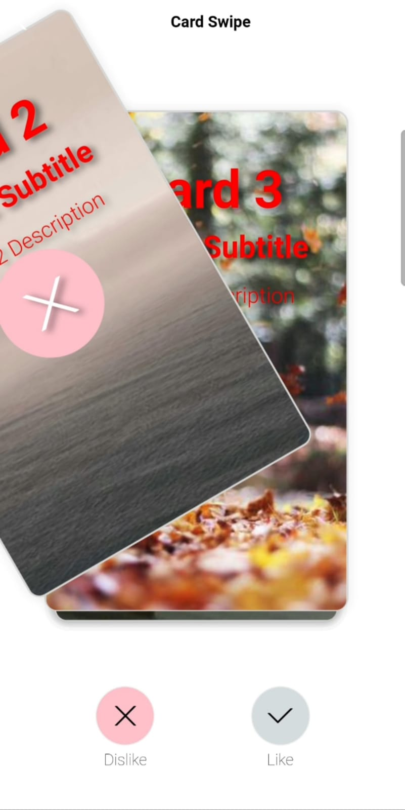

# Swpie-to-Feedback-Card
A self-made UI component for the Alipay applet to slide cards left and right to select preferences.
Social recommendation options like Tinder, Tantan, and Aloha interact with each other.


```
{
	"id": i, // id must be unique and not repeatable
	"type": "image",
	"url": `https://picsum.photos/300/600?random=1`,
	"title": `Card`,
	"subtitle": `Card Subtitle`,
	"description": `Card Description`,
	"navigateUrl": `/pages/index/index` // Redirect navigation target link 
}
```


## Demo
<video src="./assets//card-swipe.mp4" height="647" width="366"  autoplay loop muted>
</video>



## Other statements
The example uses two images randomly searched from the Internet. If there are any copyright issues, please let us know immediately.

## Open Source Agreement
This project follows the provisions of the MIT Open Source License.